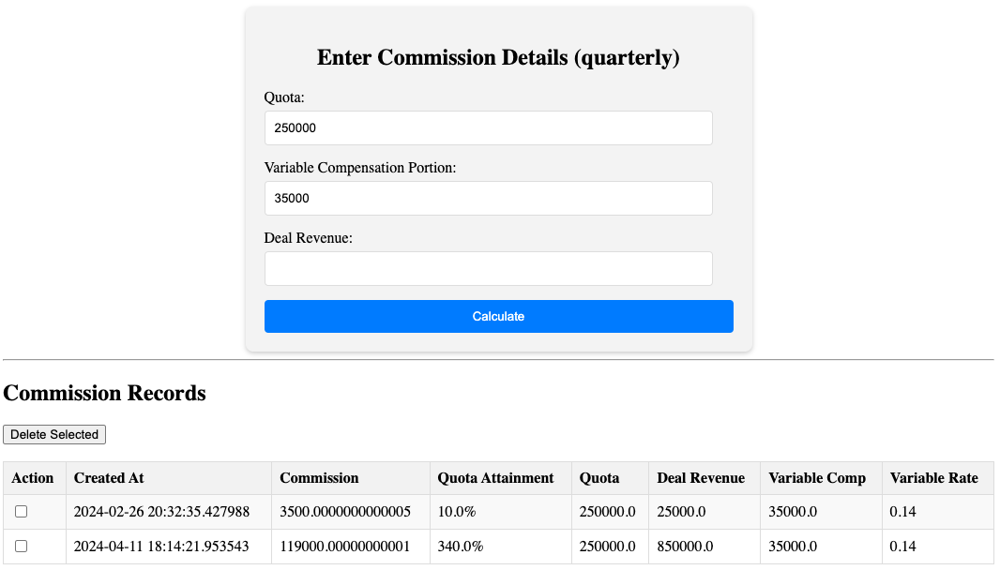

# Flask as a dev container

Flask is WSGI web app framework written in Python. This app calculates sales commissions based on user input in a standard web browser.



## dev container

I'm using a dev container so I don't have to install Python and Flask on my Mac. All I need a is a Docker daemon, which in my case is `colima` and VS Code with the dev container extension.

## Known Issues

This dev container does not appear to start Flask as a `CMD` at the end of the Dockerfile, but as `postStartCommand` in the `devcontainer.json` works. Note `postCreateCommand` only runs once so not the right one to use.

If Flask does not start, manually start the flask app with this command run within the repo directory.

```bash
flask run --host=0.0.0.0
```

## Accessing the Flask app

Open a web browser and enter `localhost:5001` to see the Flask app

## Known Issues

In Coder's `envbuilder` project that leverages dev containers, lifecycle scripts in `devcontainer.json` like `postCreateCommand` and `postStartCommand` must redirect output to a file or `/dev/null` or the workspace hangs. Add `> /dev/null 2>&1` after any commands in those scripts.

## Resources

[Related repo with Coder envbuilder support](https://github.com/sharkymark/envb-flask-hw)

[Flask](https://flask.palletsprojects.com/)

[Dev Container specification](https://containers.dev/implementors/spec/)

## License

This project is licensed under the [MIT License](LICENSE)

## Contributing

### Disclaimer: Unmaintained and Untested Code

Please note that this program is not actively maintained or tested. While it may work as intended, it's possible that it will break or behave unexpectedly due to changes in dependencies, environments, or other factors.

Use this program at your own risk, and be aware that:
1. Bugs may not be fixed
1. Compatibility issues may arise
1. Security vulnerabilities may exist

If you encounter any issues or have concerns, feel free to open an issue or submit a pull request.